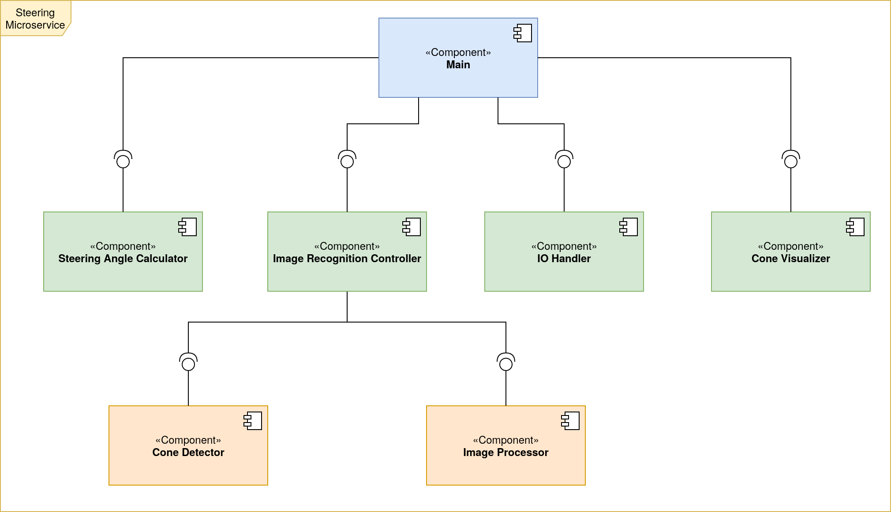

# 2021-group-04

# Step by step instructions to get started with the application

Prerequisites to build the project:
`Git`, `cmake`, `g++`, `docker`

***The following instructions have been tested in both Ubuntu 18.04.4 LTS and Ubuntu 20.04 LTS, but they might also work seamlessly for any distribution that uses APT.***

### Install g++, CMake, Git:
```bash
sudo apt-get update
sudo apt-get install build-essential cmake git
```

### Install docker
Instructions on how to install docker from docker page.
Run the following commands, as listed in the [official documentation](https://docs.docker.com/engine/install/ubuntu/)

```bash
sudo apt-get update
sudo apt-get install apt-transport-https ca-certificates curl gnupg lsb-release
curl -fsSL https://download.docker.com/linux/ubuntu/gpg | sudo gpg --dearmor -o /usr/share/keyrings/docker-archive-keyring.gpg
echo "deb [arch=amd64 signed-by=/usr/share/keyrings/docker-archive-keyring.gpg] https://download.docker.com/linux/ubuntu $(lsb_release -cs) stable" | sudo tee /etc/apt/sources.list.d/docker.list > /dev/null
sudo apt-get update
sudo apt-get install docker-ce docker-ce-cli containerd.io
```

## Cloning and building
### Browse to desired location and run the following command to clone the repository.
N.B. you need to have a public SSH-key added to be able to clone.
```bash
git clone git@git.chalmers.se:courses/dit638/students/2021-group-04
```

### Build using docker
```bash
docker build -t <name>  -f Dockerfile . # Where <name>  is the name of the docker image to be created
```

### Run the docker image
```bash
docker run --rm <name> 
```
# Architecture

## Top Level Architecture Overview


## Steering Microservice Component Diagram



# Team’s workflow
The team will work in an iterative manner where features are added as we iterate over new builds.
To proceed with adding new features the team will follow the following workflow: 

1. Each feature will be discussed in the team and high level architecture will be decided on before proceeding
2. Then the feature will be added as a milestone to Gitlab
3. The feature will be broken down to smaller issues which will be documented following the template(see template [here](.gitlab/issue_templates/issue.md))
4. The development of the issue will be done following the established code standards (see [code of conduct](code-of-conduct.md))  as well as commit message traceability and standard git workflow which includes branching, merge requests and code reviews as well as unit tests automation.
5. The issue life cycle will be traceable through Gitlab board and labels

## Issues’ resolution
The team intends to release any needed bug fixes depending on any possible defects that might result due to the aforementioned workflow. For better traceability, clarity and transparency, a specific issue shall be created (following the [Bug template](.gitlab/issue_templates/Bug.md)) along with the corresponding information about the findings, such as the steps that reproduce the issue, the difference between the expected and the actual behaviour, its severity, any possible references as well as the system’s version (release). In order to patch the issue, a different branch shall be created out of the respective staging version that includes the defect. The tag for any bug-related branches shall comply with the following format: `bugfix-title_for_specific_bug`.

## Structure and content of commit message
It shall start with an issue number then follow with a commit title.
Then it shall have a description explaining what the commit contains and possibly why this has been changed if necessary. (This may be omitted if the commit is very small and self explanatory such as fixing a typo.)
If the commit is co-authored by anyone else, then it must be appended at the end.
### Example commit message

```
#4 Update README.md

This adds further clarification to the cloning procedure of the repository

Co-Authored-By: Krasen Parvanov <krasen@student.chalmers.se>
Co-Authored-By: Alexander Hultén <hultena@student.chalmers.se>
Co-Authored-By: Eemil Jeskanen <jeskanen@student.chalmers.se>
Co-Authored-By: Chrysostomos Tsagkidis <chrtsa@student.chalmers.se>
```
